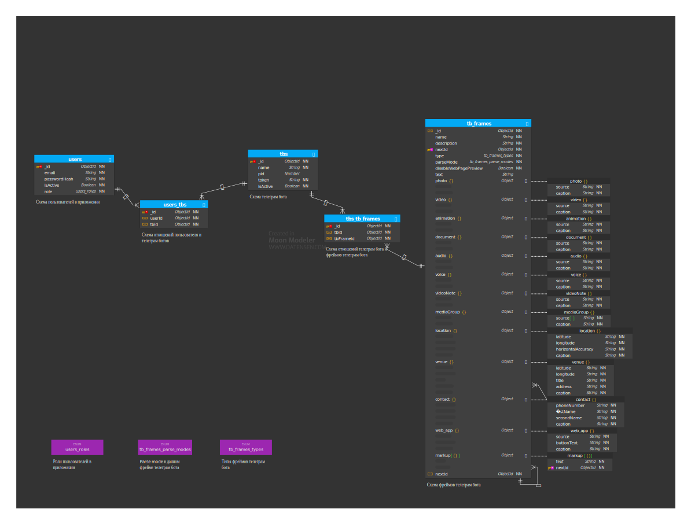

amique - проект по реализации конструктора телеграм чат-ботов.

Основная внутренняя задача проекта - спроектировать схему данных, которая бы позволяла на основе данной схемы запускать полностью исправного телеграм бота без конкретного написания кода под предметную область/логику, описанную в схеме данных.

Использование данной абстракции или метапрограммирования, на мой взгляд, единственный верный способ создавать такого рода конструкторы.

Управление данными ботами можно реализовать разными способами, реализация остается за разработчиком.

Создание схемы происходит через веб-интерфейс, реализация остается за разработчиком.

todo:

- описать схему бота
- описать внутреннее апи
- улучшить качество readme
- схема бд

выглядит ужасно :)!

- использование unix socket
- почему не запуск ботов сразу на сервере ноды? чтобы если какой-то бот сломался это не сломало весь сервер, наверное
  (ну и мой пример "шаблон" бота уже есть)

учесть данные моменты:

- https://docs.nestjs.com/fundamentals/lifecycle-events#asynchronous-initialization:~:text=listening%20for%20connections.-,onModuleDestroy,-()*

- передача схем данных для бота происходит согласно следующим пунктам:

  - сервер приложения формирует файл схемы бота при:
    - создании схемы
    - обновлении схемы
    - удалении схемы
  - при запуске бота, боту передается ссылка на файл схемы данных

- Почему не aiogram? В боте нет "долгих" задач, требующие асинхронности

- TODO: перенести логику из контроллеров в сервисы

TODO: реализовать работу с poll, dice

TODO: сделать фронтенд
TODO: сделать интерфейсы

TODO: Разрешить все TODOs и FIXMEs
TODO: названия переменных под один стиль во всем проекте
TODO: стандарт pep8 для python
TODO: пересмотреть документацию python-telegram-bot для установки ограничений
TODO: разделить readme для каждой части приложения с подробным описанием
TODO: придумать, как лучше реализовать выключение телеграм бота и юникссокета
TODO: придумать, как реализовать общение между этими процессами, чтобы бот мог отправлять данные на сервер через юникссокет и чтобы это все не блокировало друг друга
TODO: прописать будущие улучшения и мысли по реализации
